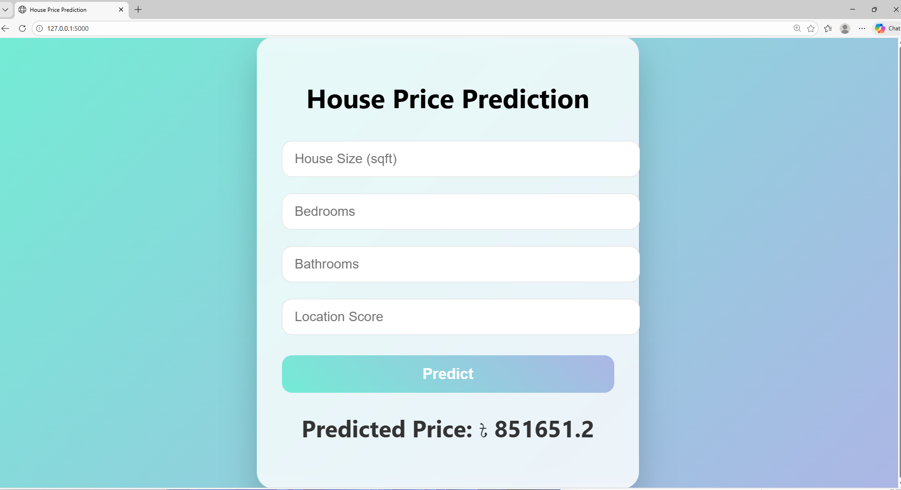

# 🏠 House Price Prediction using Machine Learning

This project predicts house prices based on multiple feature using Machine Learning and deploys the model using Flask.

---

## 📌 Project Demo

### Prediction Result
<p align="center">
  
</p>


---


## Dataset Features
- House Size (sqft)
- Bedrooms
- Bathrooms
- Location Score

Target Variable:
- Price


---

## Machine Learning Workflow
- Exploratory Data Analysis (EDA)
- Feature Scaling (StandardScaler)
- Model Training (Linear Regression)
- Model Evaluation (MAE, RMSE, R^2 Score)
- Model Deployment using Flask

---


## Tech Stack
- Python
- Pandas, Numpy
- Scikit-Learn
- Matplotlib, Seaborn
- Flask
- HTML, CSS


---

## How to Run the Project

```bash
pip install -r requirements.txt
python app.py


Then open:
http://127.0.0.1:5000/

```
## Model Performance
- MAE: Low average error
- RMSE: Penalizes Large errors
- R^2 Score: High explanatory power


## Project Structure

House-Price-Prediction/
│
├── data/
├── images/
├── models/
├── static/
├── templates/
├── app.py
├── requirements.txt
└── README.md


## Author
Sourov Roy ovi

### If you like this project, give it a star!